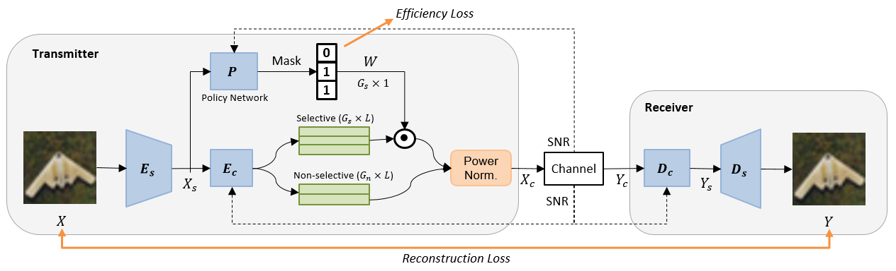

# Dynamic_JSCC

This is the code for paper [Deep Joint Source-Channel Coding for Wireless Image Transmission with Adaptive Rate Control](https://arxiv.org/abs/2110.04456). The model is implemented with PyTorch. 

# Usage
The basic settings are contained in `options/base_options.py`, `options/train_options.py`, and `options/test_options.py`. The style of coding is borrowed from [CycleGAN](https://github.com/junyanz/pytorch-CycleGAN-and-pix2pix). 

## Training
    usage: train_dyna.py [-h] [--gpu_ids GPU_IDS]
                     [--checkpoints_dir CHECKPOINTS_DIR] [--model MODEL]
                     [--input_nc INPUT_NC] [--output_nc OUTPUT_NC] [--ngf NGF]
                     [--ndf NDF] [--max_ngf MAX_NGF] [--norm NORM]
                     [--init_type INIT_TYPE] [--init_gain INIT_GAIN]
                     [--n_downsample N_DOWNSAMPLE] [--n_blocks N_BLOCKS]
                     [--C_channel C_CHANNEL] [--G_n G_N] [--G_s G_S]
                     [--select SELECT] [--SNR_MAX SNR_MAX] [--SNR_MIN SNR_MIN]
                     [--lambda_reward LAMBDA_REWARD] [--lambda_L2 LAMBDA_L2]
                     [--batch_size BATCH_SIZE]
                     [--max_dataset_size MAX_DATASET_SIZE] [--epoch EPOCH]
                     [--load_iter LOAD_ITER] [--verbose] [--suffix SUFFIX]
                     [--save_latest_freq SAVE_LATEST_FREQ]
                     [--print_freq PRINT_FREQ]
                     [--save_epoch_freq SAVE_EPOCH_FREQ] [--save_by_iter]
                     [--continue_train] [--epoch_count EPOCH_COUNT]
                     [--phase PHASE] [--n_epochs_joint N_EPOCHS_JOINT]
                     [--n_epochs_decay N_EPOCHS_DECAY]
                     [--n_epochs_fine N_EPOCHS_FINE] [--lr_joint LR_JOINT]
                     [--lr_decay LR_DECAY] [--lr_fine LR_FINE]
                     [--temp_init TEMP_INIT] [--eta ETA]
Example usage:
    
    python train_dyna.py --gpu_ids '0' --select 'hard' --SNR_MIN 0 --SNR_MAX 20 --lambda_reward 2e-3

## Testing
    usage: test_dyna.py [-h] [--gpu_ids GPU_IDS]
                    [--checkpoints_dir CHECKPOINTS_DIR] [--model MODEL]
                    [--input_nc INPUT_NC] [--output_nc OUTPUT_NC] [--ngf NGF]
                    [--ndf NDF] [--max_ngf MAX_NGF] [--norm NORM]
                    [--init_type INIT_TYPE] [--init_gain INIT_GAIN]
                    [--n_downsample N_DOWNSAMPLE] [--n_blocks N_BLOCKS]
                    [--C_channel C_CHANNEL] [--G_n G_N] [--G_s G_S]
                    [--select SELECT] [--SNR_MAX SNR_MAX] [--SNR_MIN SNR_MIN]
                    [--lambda_reward LAMBDA_REWARD] [--lambda_L2 LAMBDA_L2]
                    [--batch_size BATCH_SIZE]
                    [--max_dataset_size MAX_DATASET_SIZE] [--epoch EPOCH]
                    [--load_iter LOAD_ITER] [--verbose] [--suffix SUFFIX]
                    [--phase PHASE] [--num_test NUM_TEST]
                    [--num_test_channel NUM_TEST_CHANNEL] [--SNR SNR]
Example usage:
    
    python test_dyna.py --gpu_ids '0' --select 'hard' --SNR_MIN 0 --SNR_MAX 20 --lambda_reward 2e-3 --num_test 10000 --num_test_channel 1 --SNR 5
    
## Reference

    @misc{yang2021deep,
      title={Deep Joint Source-Channel Coding for Wireless Image Transmission with Adaptive Rate Control}, 
      author={Mingyu Yang and Hun-Seok Kim},
      year={2021},
      eprint={2110.04456},
      archivePrefix={arXiv},
      primaryClass={eess.SP}
    }
